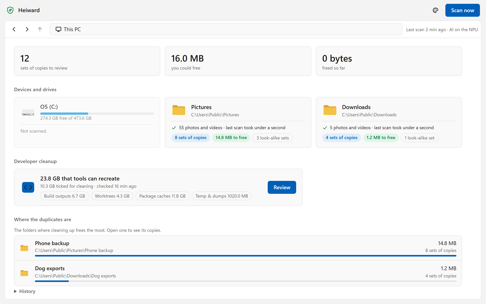
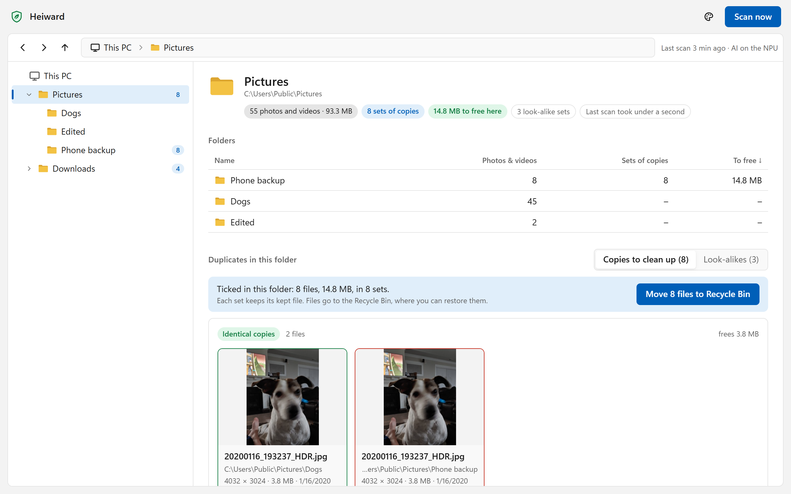
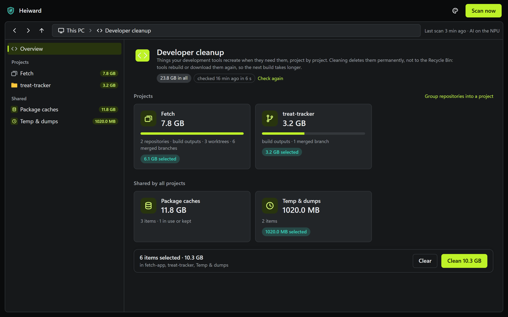
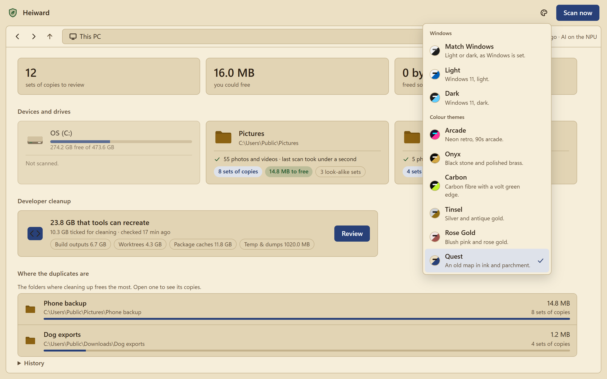

# Heiward

Heiward is NPU-first AI for Windows. It runs a vision model, DINOv2, on the PC's NPU (the AI processor in Snapdragon X, Intel Core Ultra and AMD Ryzen AI PCs) to find duplicate photos and videos, including resized, recompressed, cropped, mirrored and edited copies. On the NPU it's fast and barely uses power, so it can scan every hour in the background. All of it runs on your PC: nothing about you or your files leaves it.

It lists what it finds, and stale developer files in developer mode, on a local review page. Nothing is removed until you say so, and files you tick go to the Recycle Bin. Once you trust what it suggests, it can clean up by itself.

- **NPU first.** Heiward detects the PC's NPU and downloads that vendor's runtime: Qualcomm QNN, Intel OpenVINO, or AMD Vitis AI through Windows ML. A badge in the title bar shows where the AI runs, and why not on the NPU. Without one it falls back to the GPU or CPU, every 6 hours on AC power or only when you ask. It takes turns with other NPU tools on the PC that use the same lock.
- **Light on power.** Scheduled scans run in Windows' efficiency mode, with a cap on the processor. Scan now, and any scan while the page is open, runs at full speed.
- **The whole PC, minus what isn't yours.** Every fixed drive, leaving out Windows, programs, games, app data and code repositories. Cloud-only files are never downloaded. Right-click a folder on the page to include it or leave it out, or a drive to scan it only when you ask, so an archive disk can sleep.
- **Laid out like File Explorer.** A card per drive, a folder tree, and the duplicates of the folder you're in. Only identical files and pixel-level copies are ticked for you. Burst shots (`IMG_1234`, `IMG_1235`) and pictures less than 75% alike aren't offered as look-alikes, and a folder's look-alikes can be skipped all at once.
- **Developer cleanup, project by project.** Build outputs, finished worktrees, package caches, unused emulator images, old temp files, and a button that prunes local branches already merged into main. It's off until you turn on Developer mode in Settings.
- **Automatic cleanup, when you're ready.** Two switches let it clean plain copies and developer leftovers by itself, a few days after listing them, with a "Leave it" button on each. Edits, look-alikes, cloud-synced copies and anything that looks like a backup always wait for you.
- **Themes.** Match Windows, Light, Dark, and six colour themes.

A *heiward* (Middle English, "hedge warden") was the village officer who kept the hedges trimmed and the fences sound.

<table>
<tr>
<td width="50%"></td>
<td width="50%"></td>
</tr>
<tr>
<td>A folder and its duplicates. Each set keeps one file; the copies go to the Recycle Bin.</td>
<td>Developer cleanup, project by project (Carbon theme).</td>
</tr>
<tr>
<td width="50%"></td>
<td>Match Windows, Light, Dark, or one of six colour themes (Quest here).  The dogs are the author's own. The developer projects are made up.</td>
</tr>
</table>

## Install

1. Download from [Releases](https://github.com/Jcollier0120/Heiward/releases):
   - `Heiward-<version>-x64.exe` for most PCs (Intel or AMD);
   - `Heiward-<version>-arm64.exe` for Arm PCs, such as Snapdragon Copilot+ PCs.

   Not sure which? **Settings > System > About** says "x64-based processor" or "ARM-based processor".
2. Run it.

There's nothing to install first: no .NET, no FFmpeg, no admin rights. Heiward downloads what it needs itself and runs its first scan, and the review page opens in your browser to show its progress. It asks how hard scans should work: in the background, slower and light on power, or at full speed. On a PC without an NPU it also asks whether to run the AI on the graphics card or the processor.

The releases aren't code-signed yet, so the first run shows "Windows protected your PC": click **More info**, then **Run anyway**. On a PC with Smart App Control turned on, Windows blocks unsigned apps outright, so those PCs will need a signed release. `SHA256SUMS.txt` on the release lists each file's SHA-256, which PowerShell's `Get-FileHash` shows.

To remove it, uninstall **Heiward** in Settings > Apps. Its window says when it's done, or what stopped it; either way the steps are in `%LOCALAPPDATA%\Heiward\heiward.log`. Your settings and history stay there, for a later install (`hei uninstall --purge` deletes them too).

To build it yourself, see [Build](HEI.Agent/README.md#build). Settings, commands and how it decides what to tick are in [HEI.Agent/README.md](HEI.Agent/README.md).

# License
Heiward is free software under the GNU AGPL v3 ([LICENSE](LICENSE)).

It includes code from [Video Duplicate Finder](https://github.com/0x90d/videoduplicatefinder) (© 0x90d and contributors), also under the AGPL v3: the scan engine (`HEI.Core`), and the desktop app, command line and web UI this repository still builds (`HEI.GUI`, `HEI.CLI`, `HEI.Web`; their documentation is [Video Duplicate Finder's README](https://github.com/0x90d/videoduplicatefinder#readme)).

When Heiward installs, it downloads FFmpeg, ONNX Runtime and the DINOv2 model, plus the NPU runtime for the PC's NPU (Qualcomm QNN, Intel OpenVINO, or AMD Vitis AI, which Windows ML supplies) or DirectML for a GPU. Each carries its own licence.

The optional AI components are downloaded separately on first use and carry their own licenses: ONNX Runtime (MIT) and the DINOv2-small embedding model (Apache-2.0). Neither is bundled with or linked into the release binaries.

# Credits / Third Party
- [Avalonia](https://github.com/AvaloniaUI/Avalonia)
- [ActiPro Avalonia Controls (Free Edition)](https://github.com/Actipro/Avalonia-Controls)
- [FFmpeg.AutoGen](https://github.com/Ruslan-B/FFmpeg.AutoGen)
- [MemoryPack](https://github.com/Cysharp/MemoryPack)

- [AcoustID.NET by wo80](https://github.com/wo80/AcoustID.NET) — the audio fingerprinting pipeline (Chromaprint-style chroma extraction, FIR smoothing, and fingerprint encoding) used for partial clip detection is derived from this library, licensed under LGPL 2.1

- [ONNX Runtime](https://github.com/microsoft/onnxruntime) (Microsoft, MIT) — inference engine for the optional AI matching feature
- [DINOv2](https://github.com/facebookresearch/dinov2) (Meta AI, Apache-2.0) — the image embedding model behind AI matching, used as the int8-quantized ONNX export from [Xenova/dinov2-small](https://huggingface.co/Xenova/dinov2-small) (mirrored on this repo's [ai-models-v1 release](https://github.com/0x90d/videoduplicatefinder/releases/tag/ai-models-v1))
